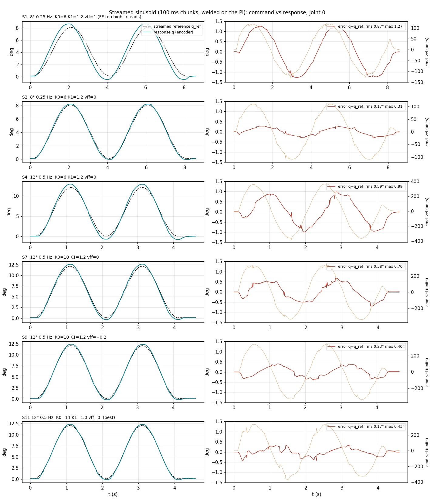
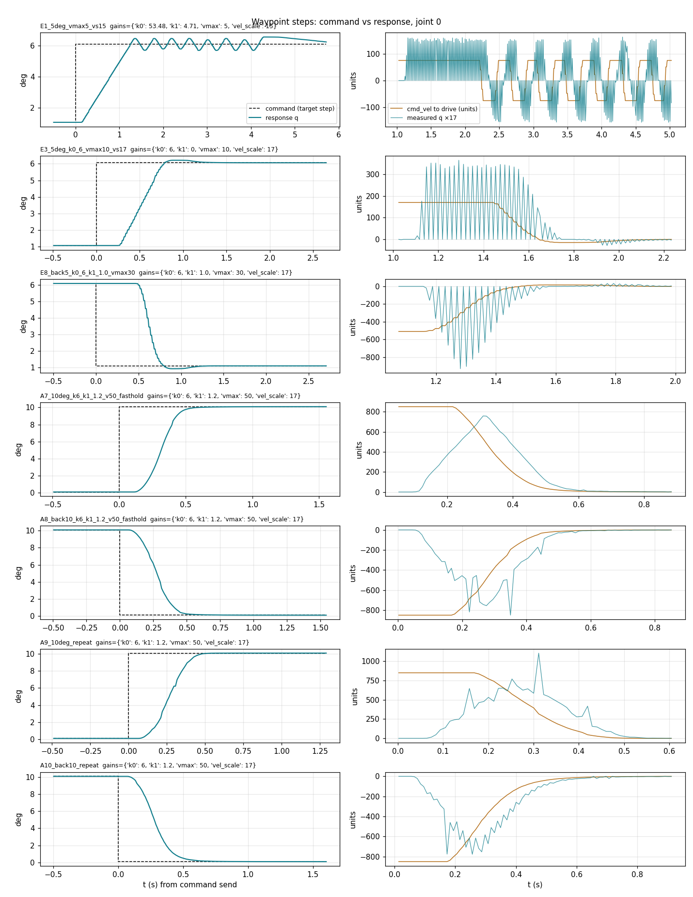

This is the custom MPC (placeholder) for mycobot pro 630 robot from Elephant Robotics


The robot is the 6DOF manipulator controlled by STM32 and connected to Raspberry Pi(4) for control
Existing python api has slow communication (>20ms) and not responding while the command is done.

- By directly using the HAL, communication between the STM32 <==> Raspi becomes around 2.1 ms (safely use 3ms)
- But if computing MPC or trajectory optimization in a separate computed, this can be increased


Connect to the raspi via SSH with pi@10.0.0.27


In raspi, run the command with 

```linuxcnc /home/pi/Desktop/mpc/elerob_mpc.ini```

RVIZ2 (ros2) command to show mycobot pro 630 urdf with single suction cup gripper 

```source ~/miniconda3/etc/profile.d/conda.sh && conda activate ros_env && source ~/ros2_ws/install/setup.zsh && cd ~/ros2_ws && colcon build --packages-select mycobot_description --symlink-install && source ~/ros2_ws/install/setup.zsh && ros2 launch mycobot_description display.launch.py```


joystick controller 
```PYTHONPATH= python3.10 joystick_controller.py --host 10.0.0.27 --speed medium --hz 20```

## ROS 2 bridge (robot as a ROS 2 node)

`robot_hal.py` runs inside LinuxCNC and exposes two TCP servers (port **9999**
joint-state stream, port **9998** command/status). `mycobot_ros2_bridge.py`
wraps those into a ROS 2 node so the arm is a first-class fleet peer — it does
**not** touch HAL directly (only the LinuxCNC process can).

**Published topics**

| Topic | Type | Meaning |
|-------|------|---------|
| `/joint_states` | `sensor_msgs/JointState` | joint angles in URDF **radians** (rviz-ready) |
| `/mycobot/joint_states_deg` | `sensor_msgs/JointState` | raw LinuxCNC **degrees** |
| `/mycobot/status` | `std_msgs/String` | controller status JSON (state, error_norm, …) |
| `/mycobot/clock_offset_ms` | `std_msgs/Float64MultiArray` | live `recv - robot_stamp` (sync quality) |

### Timestamp synchronization

`robot_hal.py` stamps every stream packet with `time.time()` on the Pi. The
bridge uses **that source time** as the ROS header stamp (`--stamp robot`,
default) instead of the desktop's receive time, so `/joint_states` reflects when
the joints were actually sampled — consistent across the whole fleet **as long
as the Pi and desktop clocks are NTP/chrony-synced**. The bridge publishes and
logs `recv - robot_stamp` on `/mycobot/clock_offset_ms` so you can watch sync
quality live (≈ network latency when synced; large/drifting ⇒ clocks not
synced). Use `--stamp local` to fall back to desktop receive time.

**Subscribed topics / service**

| Topic | Type | Meaning |
|-------|------|---------|
| `/mycobot/cmd/joint_deg` | `std_msgs/Float64MultiArray` | 6 target angles, LinuxCNC degrees |
| `/mycobot/cmd/joint_rad` | `sensor_msgs/JointState` | 6 targets, URDF radians |
| `/mycobot/cmd/move` | `std_msgs/String` | raw JSON: `{"target_deg":[...],"duration":3,"controller":"pid"}` |
| `/mycobot/home` (service) | `std_srvs/Trigger` | move to the home pose |

Targets are clamped to the LinuxCNC soft limits from `joint_conventions.py`.

**Run** (after starting `linuxcnc elerob.ini`, which runs `robot_hal.py`):

```bash
# on the Pi (robot is local):
python3 mycobot_ros2_bridge.py --robot-host 127.0.0.1
# from the desktop instead:
python3 mycobot_ros2_bridge.py --robot-host 10.0.0.27
```

**Move the arm** (⚠️ real motion — clear the workspace, keep e-stop in reach):

```bash
python3 move_arm_ros2.py --home
python3 move_arm_ros2.py --deg -90 -90 0 -90 0 0 --duration 3 --controller pid --wait
# or directly:
ros2 topic pub --once /mycobot/cmd/move std_msgs/String \
  '{data: "{\"target_deg\":[0,-90,0,-90,0,0],\"duration\":3}"}'
ros2 service call /mycobot/home std_srvs/srv/Trigger
```

### Calibration over ROS 2 (synced-timestamp logging)

`calibrate_ros2.py` runs the `calibrate_perturb.py` sequence **through the
bridge** and logs command input + robot response on one synchronized clock. For
each joint it perturbs +/-`step` deg about a measured base pose, returning to
base between moves: `base -> base[j]+step -> base -> base[j]-step -> base`.

```bash
python3 calibrate_ros2.py --dry-run                 # print the plan, no motion
python3 calibrate_ros2.py --quick                   # smoke test: joint 0, +/-5 deg
python3 calibrate_ros2.py --step-deg 10 --duration 6   # full perturbation set
```

Output: `logs/calibrate_ros2_<stamp>.jsonl`, one JSON object per line. Commands
are stamped with the desktop clock; responses (`/joint_states`,
`/mycobot/status`) with the robot's source time — both on the **same NTP/chrony
-synced timeline** (`t_sync`):

```json
{"t_sync": ..., "type": "command",  "label": "J0+5", "target_deg": [...]}
{"t_sync": ..., "type": "response", "source": "joint_states", "joints_rad": [...]}
{"t_sync": ..., "type": "response", "source": "status", "current_deg": [...], "error_norm": ...}
```

> Requires the Pi and desktop clocks to be synced (see `ros2node` chrony setup).
> The robot must be running `linuxcnc /home/pi/Desktop/mpc/elerob.ini` (the only
> ini whose HAL starts `robot_hal.py`'s 9998/9999 servers).

Plot command vs response from a log:

```bash
python3 plot_calibrate_ros2.py            # newest log -> logs/<stamp>.png
```

It overlays each joint's commanded target (step) on the measured response
(`/joint_states`, converted back to LinuxCNC degrees) against `t_sync`.

**Test without hardware** — `tests/mock_robot_server.py` emulates the 9999/9998
protocol so the bridge and move scripts can be exercised on any machine:

```bash
python3 tests/mock_robot_server.py &          # fake robot
python3 mycobot_ros2_bridge.py --robot-host 127.0.0.1 &
ros2 topic echo /joint_states                  # watch state
python3 move_arm_ros2.py --deg 45 -90 0 -90 0 0
```

## cuRobo motion-planning controller (collision-free)

`curobo_controller_node.py` turns a **goal** (Cartesian pose or joint target)
into a **collision-free trajectory** with NVIDIA cuRobo, then streams it to the
arm through the bridge's existing `trajectory` command path. cuRobo (Py3.10 +
CUDA) and rclpy (system Humble, Py3.8) can't share a process, so the GPU
planning runs in a sidecar — `curobo_planner_server.py`, in the `curobo` conda
env — and the node talks to it over a newline-JSON socket (the same pattern
`robot_hal.py` uses for 9998/9999).

```
goal ─▶ curobo_controller_node (rclpy) ─socket▶ curobo_planner_server (GPU)
        │                                          │  MotionGen, collision spheres
        │  rad → LinuxCNC deg                       ▼  → trajectory (URDF rad + dt)
        └─▶ /mycobot/cmd/move ─▶ bridge ─▶ robot_hal (tracks the trajectory)
```

`curobo_planner_server.py` lives with the cuRobo config at
`frankkimrobotics/ros2_mycobot/src/mycobot_description/curobo/`.

**Topics**

| Topic | Type | Direction | Meaning |
|-------|------|-----------|---------|
| `/joint_states` | `sensor_msgs/JointState` | sub | current q (URDF rad) → plan start |
| `/mycobot/curobo/goal_pose` | `geometry_msgs/PoseStamped` | sub | EE goal in `base_link` |
| `/mycobot/curobo/goal_joint` | `sensor_msgs/JointState` | sub | joint goal (URDF rad) |
| `/mycobot/cmd/move` | `std_msgs/String` | pub | trajectory command for the bridge |
| `/mycobot/curobo/status` | `std_msgs/String` | pub | plan result JSON (success, solve_time, …) |

**Run** (planner + bridge must be up; the bridge can run against
`tests/mock_robot_server.py` for a hardware-free dry run):

```bash
# 1) GPU planner (curobo env). --ground-z sets the table height in base_link.
conda activate curobo
python curobo_planner_server.py                      # 127.0.0.1:9997
#   add obstacles with a cuRobo world yaml:  --world world.yml

# 2) controller node (system ROS env). DRY RUN by default — add --execute to move.
python3 curobo_controller_node.py                    # plan + log only
python3 curobo_controller_node.py --execute --controller pid

# 3) send a goal
ros2 topic pub --once /mycobot/curobo/goal_pose geometry_msgs/PoseStamped \
  '{header: {frame_id: base_link}, pose: {position: {x: 0.30, y: 0.20, z: 0.35},
    orientation: {w: 0.0, x: 1.0, y: 0.0, z: 0.0}}}'
ros2 topic echo /mycobot/curobo/status
```

> ⚠️ `--execute` moves the real arm. Without it the node plans, logs, and
> publishes `/mycobot/curobo/status` but sends nothing. The planner enforces
> self-collision + the ground/obstacle world; targets are still clamped to the
> LinuxCNC soft limits by the bridge.

### Planner backend: v1 vs V2 (dynamics-aware)

The controller node is backend-agnostic (same socket protocol on port 9997).
Pick the planner server:

| Server | Env | Planner |
|--------|-----|---------|
| `curobo_planner_server.py` | `curobo` (0.7.7) | kinematic trajopt (vel/accel/jerk limits) |
| `curobo_planner_server_v2.py` | `curobo2` (0.8.0) | **dynamics-aware** trajopt: B-spline + torque limits + inverse dynamics |

cuRobo **V2** reads link mass/inertia/CoM from the URDF `<inertial>` tags and
joint torque limits from `<limit effort=...>` — so the mesh-derived inertials
(`compute_inertia.py`) actually feed its planning. The V2 server also returns
the **B-spline control points** in the response (`control_points`), alongside
the sampled trajectory. The V2 robot config is auto-ported from the v1 yaml at
startup to `mycobot_pro_630_v2.yml`.

```bash
# V2 backend (dynamics-aware); curobo2 env
conda activate curobo2
python curobo_planner_server_v2.py            # 127.0.0.1:9997
# then the SAME controller node, unchanged:
python3 curobo_controller_node.py --execute
```

> Note: the URDF `<limit effort>` values are still the placeholder `1000` Nm, so
> V2's torque limiting is effectively inactive until realistic joint torque
> limits are set. The inertials are real (mesh-derived); the effort limits are
> the remaining piece for meaningful torque-aware planning.

## online_servo — 4 ms streaming controller (vs robot_hal)

`robot_hal.py` converges to a target **per command** (~600 ms/cmd), so it can't track a
high-rate stream. `online_servo.py` replaces it when driving the arm from an **online /
streaming planner**: it **welds incoming trajectory chunks** into a continuous reference
`q_ref(t)` and **servos it at the HAL command rate** (`controller_params period_ms=4` →
**250 Hz**), so the desktop just streams chunks.

```
desktop planner ── weld chunks (TCP JSON, :9994) ──▶ online_servo  → q_ref(t)
  servo @250 Hz:  target = q_ref(now + lead)  → PID → HAL pos/vel cmd   (pure-PD, no windup)
  feedback on :9999  (joints_deg + per-joint torque pro600.joint{i}_torqfb)
```

- **Dead-time lead** — the actuator has a constant transport dead-time; sampling
  `q_ref(now + lead)` cancels it for known trajectories (only reactive events pay the delay).
- **Pure-PD** — the welded reference is the feed-forward, so the integral is dropped (a
  wound-up integral through the dead-time was the source of terminal overshoot).
- **Torque in the stream** — `:9999` now also carries `pro600.joint{i}_torqfb`, enabling
  torque-based contact detection on the desktop side.

Load it instead of `robot_hal.py` via LinuxCNC (the Pi runs `loadusr -Wn ctrl python
online_servo.py` from **`elerob_online.hal`**, started with `linuxcnc elerob_online.ini`).
**`elerob_online.hal`** also moves the PID + `pro_socketcan` off the 20 ms slow-thread onto a
fast thread (staged at 10 ms; 4 ms target) with `motor_time_interval` matched — otherwise the
4 ms loop is downsampled to 50 Hz at the drive (the HAL link itself is ~2.1 ms).

The cuRobo planner can feed it as **0.4 s sliding-window chunks at 10 Hz**; the welder bridges
the 10 Hz chunk rate to the 250 Hz control rate. (Desktop side: `../pick_and_place`
`online_planner_node.py` + `chunk_to_pi.py`.)

## MPC on the real robot — validated process (2026-08-24)

> **Superseded on 2026-09-17** — the gains below limit-cycle on the real drive and the
> velocity feedback they assumed was never real. See *Hardware calibration, agile tuning and
> latency (2026-09-17)* at the end of this file for what actually runs now.

The `mpc` controller is now a **lag-aware LQR-clamp** (`controller_solvers.mpc_solve`):
`u = -K @ [pos_err, vel]`, `K = [53.48, 4.71]`, clamped ±40 °/s — the closed form of a
2-state drive-lag MPC, sim-tuned on the MuJoCo twin to **0.0% overshoot** at the
drive-limited rise time (the old integrator MPC overshot ~5% = the drive braking
distance; pure PID rings 17–21%). Solver-free, so it runs on the Pi (no osqp needed).
Gains assume drive lag kv≈40/s @ 4 ms; recompute via the DARE if stage-1 identification
disagrees.

### Bring-up ritual (the only sequence that reliably works)

1. Power the arm; press the base START button once (watch `pro600.svr_poweroned`).
2. Kill any stale stack: all `linuxcnc` pids + `rm /tmp/linuxcnc.lock`.
3. `linuxcnc ~/Desktop/mpc/elerob.ini` — robot_hal then self-initializes everything
   (drive power-on, motor init, machine-on, ctrl preload) and serves :9998/:9999.
4. Home if using the headless variant (`set home -1` via linuxcncrsh :5007).
5. **Probe before any motion**: command +1° on J1, verify the :9999 stream moves.
   Frozen drives + repeated commands wind the PID integral into a jump hazard.

### robot_hal changes to keep (in this repo's copy)

* **Idle hold mode**: between commands robot_hal now re-servos the last target in
  0.6 s bursts (0.4 s breather for the stream thread). Without it the 250 Hz loop
  stopped at command end → drives coasted → gravity sag ~0.4 °/s → STM32
  ferror-tripped the enable (the recurring "drift"/dropout).
* `mpc_solve` receives `q_vel` (the lag model is useless with v=0).

### Validation protocol

`pick_n_place/real_ctrl_validate.py --exec` (dry-run without `--exec`):
stage 1 fits the real drive lag from a +5° step (gate: within 30% of kv=40);
stage 2 replays the sim step-bench with `pid` vs `mpc` and prints metrics against
the sim predictions (mpc: 0% overshoot, 0.5–0.7 s settle); stage 3 steps all six
joints at once (coupling check). Probes before every case, homes between cases,
logs everything, writes a comparison plot.

Known hardware caveat: servo-enable hold-time degrades across soft restarts and
resets only with a full power cycle — suspected 48 V path issue, physical
inspection pending. Time-box on-robot sessions accordingly.

## Hardware calibration, agile tuning and latency (2026-09-17)

Everything in this section was measured on the real Pro 630 (joint 0, arm folded, base
rotation only) with the tools added the same day. The numbers replace the sim-tuned values
above.

### Network: use the cable, not WiFi

`10.0.0.27` is the Pi's **wlan0**. Commands over it showed 50–125 ms latency spikes. The Pi's
`eth0` is cabled straight to the desktop's `enp5s0` (NetworkManager profile `raspi-direct`,
`192.168.50.1/24`); a systemd unit on the Pi (`eth0-direct-link.service`) adds
**`192.168.50.2/24`** to `eth0` at boot. Use `pi@192.168.50.2` for `:9998/:9999`, ssh and scp:
1–2 ms typical, 5 ms worst over 320 streamed chunks.

### ctrl_tuner — step / stream tuner with live plots

```bash
python3 ctrl_tuner.py                      # http://127.0.0.1:8765 (defaults: 192.168.50.2)
ssh -L 8765:localhost:8765 <desktop>       # from a laptop, then open http://localhost:8765
```

`ctrl_tuner.py` (stdlib only) talks to `robot_hal` directly on `:9998/:9999` — no ROS bridge.
`ctrl_tuner.html` gives sliders for every gain, a step test, a streamed-sinusoid test, the
real-vs-sim response plot, per-hop latency for each move, and overlays of saved runs
(`logs/tuner_runs/*.json`). It works standalone in sim-only mode when opened as a file.
The architecture diagram is in the collapsible panel at the top of the page.

### robot_hal: what changed on the Pi (this repo's copy is the running one)

* **Per-move overrides** in the command JSON: `"gains": {...}`, `"period_ms"`, `"vel_cmd_max"`.
  Keys — mpc: `k0 k1 vmax vel_scale`; pid: `kp kd ki u_max integral_clamp`; pd_velff: `kp kd`.
  Overrides clear after the move; hold mode uses the file defaults.
* **Safety clamps on every HAL write**: `|pos_cmd − q| ≤ 3°` and `|vel_cmd| ≤ vel_cmd_max`
  (default 100 units). The yaml PID (`kp` 5000–8000) is unusable with robot_hal: a 0.03° error
  produced a 168° `motor_poscmd` gap and the firmware powered the arm off ("Position cmd and
  fb are too far apart"). Hold mode now uses the bounded mpc law at 5 units, aborts the instant
  a command is queued, and has no breather sleep.
* **Feedback comes from `pro600.jointN_posfb` pins**, not `linuxcnc.stat`. `stat`'s joint
  velocity is the trajectory planner's *commanded* velocity — **zero whenever ctrl drives the
  joints** — so every earlier `K1` was acting on nothing (steps) or as `K1·v_ref` feedforward
  (streaming). Velocity is now a finite difference of the pins. (`USE_STAT_FEEDBACK=False`.)
* **Streaming mode** (welded chunks):
  `{"chunk": [[6 deg], ...], "traj_dt": 0.01, "t_anchor": <epoch>, "seq": k, "gains": {...}}`.
  Chunks weld into one `q_ref(t)`; the law is
  `u = vff·v_ref − K0·(q − q_ref) − K1·(q̇ − v_ref)`, clamped to `vmax`, `vel_cmd = u·vel_scale`.
  Reply `{"state":"ack_chunk", "seq", "t_recv", "n_ref"}`. Send chunks ≥ 100 ms ahead of their anchor.
* **Latency stamps** in the status: `t_recv`, `t_dequeue`, `t_loop0`, `t_write0`, `t_done`;
  CSV logs gained a `t_epoch` column; status cadence 20 Hz (was once per second).
* Stream thread hardened (it died on an uncaught `linuxcnc.error` under load).
* `elerob.hal`: `loadusr` pinned to `/usr/bin/python3 -u` (the login shell's `python3` is pyenv
  3.10 without yaml); `mux-gen.*` moved onto the slow-thread just before `pro_socketcan.update`;
  slow-thread and `motor_time_interval` 20 → **10 ms**; `motor_accelaration` **4×** (see below).
* `launch_mpc_stack.sh`: clean relaunch as a user service (kills the vendor stack, clears the lock).

### Calibration results

| quantity | value |
|---|---|
| drive velocity unit (`pro600.jointN_poscmd`) | **≈ 17 units per °/s**, linear 5–510 units |
| drive velocity saturation | ≈ 50 °/s |
| drive acceleration cap, 1× (2097152) | 250 °/s² — only read at drive **init**, `setp` live does nothing |
| drive acceleration cap, 4× (8388608, now default) | 720–870 °/s², 0.0–0.1 % overshoot, fault-free |
| START button | needed after every robot_hal exit (its shutdown drops `pro600.poweron`) |

### Gains that work (mpc law, `vel_scale 17`)

| use | K0 | K1 | vff | vmax | result |
|---|---|---|---|---|---|
| waypoint steps (10°) | 6 | 0 | — | 50 | peak 45–50 °/s, 0.1 % overshoot, rise 0.27 s, settle ±0.5° 0.43 s |
| streamed trajectory | 20 | 0.3 | **1.0** | 50 | 12° 0.5 Hz sine: rms 0.10°, max 0.23°, lag 0–5 ms |
| deployed before (sim-tuned) | 53.48 | 4.71 | — | 40 | **relay limit cycle ±0.4° at 2.4 Hz** (dead-time × clamp) |

With `vff = 0` a streamed reference lags by exactly `1/K0` (70 ms at K0 = 14). Lookahead
(`lead`) does not help; K0 above ~8 rings on steps.




### Latency per hop, one waypoint (ms), cable, 10 ms threads, accel 4×

| hop | before (morning) | now |
|---|---|---|
| desktop → Pi TCP command received | 2–4 | 1–2 |
| Pi queue wait (hold loop) | 0–100 | 0.3 |
| dequeue → first control loop | 0.5 | 0.5 |
| poll + solve → HAL pin write | 2–3 | 2–3 |
| HAL write → first encoder motion (0.02°) | 65–77 | 36–52 |
| HAL write → motion past 0.2° | 95–108 | 56–69 |
| stream sample Pi → desktop | 0.2–0.8 | 0.2–0.4 |
| **total: send → motion seen on desktop** | **112** | **≈ 75** |

What remains is CAN (2.8 ms per cycle) plus STM32/drive firmware. **5 ms threads** (set
`period1`, `motor_time_interval` *and* `SERVO_PERIOD` in `elerob.ini` to 5 ms — the ini caps
thread periods) take another ~10 ms off and halve the streaming error (rms 0.06°), but the CAN
update then fills 3.5 ms of every cycle (12 ms worst) and CAN error-state events double
(1.5/s vs 0.8/s idle) on a bus with a wiring history. Left as an opt-in; recipe at the bottom
of `elerob.hal`.

### Streaming a cuRobo plan (2026-09-17)

`ctrl_tuner` `/api/stream_traj` streams any dense 6-joint trajectory (LinuxCNC deg, uniform `dt`):
checks the start pose and soft limits, time-scales to `max_vel_deg` (only ever slows), chunks at
10 Hz and welds on the Pi. A cuRobo `plan_pose` 10 cm straight down and back (joint 0 rig, wall at
x = −0.30 m, ground at z = −0.10 m in the planner world) tracked with rms 0.21° / max 0.43° on the
elbow and landed within 0.1 mm of the goal by FK (`docs/curobo_descent.png`).

**B-spline control-point input is not supported yet** — see `TODO_BSPLINE.md` for the plan.

### Bring-up as of 2026-09-17

```bash
ssh pi@192.168.50.2 ~/Desktop/mpc/launch_mpc_stack.sh      # then press START on the base if
                                                            # pro600.svr_poweroned stays FALSE
halcmd show pin ctrl.joint0_pos_cmd pro600.joint0_posfb    # must match before any motion
python3 ctrl_tuner.py                                       # 1° probe first, then steps
```

Unpowered-drive signature (START not pressed, or deaf CAN): encoders read fine but
`status_word 0x0`, `svr_poweroned FALSE`, task_state 2, CAN TX counter frozen.

