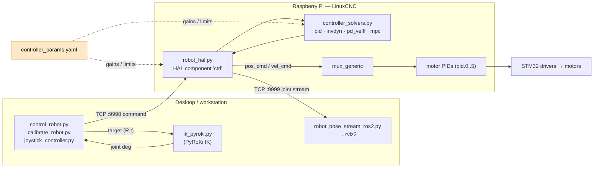

# mycobot_mpc — Real-time control for the myCobot Pro 630

Control stack for the **Elephant Robotics myCobot Pro 630** running on a
Raspberry Pi under **LinuxCNC + HAL**, driven from a desktop over TCP. One
unified HAL component (`robot_hal.py`) implements four selectable control laws —
**PID**, **inverse dynamics**, **PD + velocity feedforward**, and **MPC** — using
solvers shared with the MuJoCo simulator in the parent repo.

> **Note:** this package was consolidated. The earlier per-controller scripts
> (`mpc_hal.py`, `invdyn_hal.py`, `mpc_linuxcnc.py`, `invdyn_linuxcnc.py`) and
> their `elerob_mpc.*` / `elerob_invdyn.*` configs are gone — `robot_hal.py`
> with `--controller {pid,invdyn,pd_velff,mpc}` supersedes all of them.

---

## Architecture



**Control loop (per tick, ~`period_ms`):** the desktop sends a target joint pose
once per move → `robot_hal.py` reads joint feedback from HAL → the selected
solver in `controller_solvers.py` produces `pos_cmd` / `vel_cmd` → written to HAL
pins → `mux_generic` routes them to `pid.N.command` when `ctrl.enable` is true →
the motor PIDs and STM32 drivers track them.

The **same `controller_solvers.py` + `controller_params.yaml`** are imported by
`../mujoco_viewer.py`, so a controller tuned in simulation is the controller that
runs on hardware.

---

## Files

### Core control (the unified stack)
| File | Role |
| --- | --- |
| `robot_hal.py` | LinuxCNC HAL component `ctrl`. Selectable law via `--controller`; per-move override via JSON from the desktop. Runs the command server (`:9998`) and joint stream server (`:9999`). |
| `controller_solvers.py` | Shared solvers: `pid_solve`, `invdyn_solve`, `pd_velff_solve`, `mpc_solve` (TinyMPC, OSQP fallback). Gains loaded from the YAML. Also used by `../mujoco_viewer.py`. |
| `controller_params.yaml` / `controller_params.py` | All gains and limits (Hydra-style) + loader. Single source of tuning. |
| `joint_conventions.py` | **Shared** joint constants and the LinuxCNC↔URDF deg/rad conversions (was duplicated across 5 files). |

### Desktop clients
| File | Role |
| --- | --- |
| `control_robot.py` | Target pose → IK → joint angles → TCP to the robot. Cartesian / joint / interactive / home moves. |
| `calibrate_robot.py` | Scripted per-joint sweeps to gather system-ID data. |
| `joystick_controller.py` | DualShock 4 teleoperation (jog EEF position/orientation). |
| `ik_pyroki.py` | PyRoKi IK for the `eef` frame, with URDF↔LinuxCNC calibration. |
| `robot_pose_stream_ros2.py` | Launch rviz2 and stream live joint poses to `/joint_states`. |

### Dynamics & system identification
| File | Role |
| --- | --- |
| `invdyn_model.py` | Load identified `M(q), C(q,q̇), G(q)` from `.npz`; Drake-style desired-acceleration → torque. |
| `identify_invdyn_from_log.py` | Fit `M, C, G`, friction, and torque scale from robot CSV logs → `logs/invdyn_params.npz`. |
| `probe_hal_mass_inertia.py`, `get_torque_scale_from_raspi.py` | HAL probing utilities. |

### Simulation, plotting, tests
| File | Role |
| --- | --- |
| `sim_mpc.py` | Offline closed-loop sim of the PD/MPC solvers (no hardware). |
| `plot_log.py` / `plot_hal.py` | Plot robot/desktop logs. |
| `plot_common.py` | **Shared** plot helpers: dirs, color palette, `load_robot_csv`, `save_fig` (was duplicated). |
| `test_controller.py` | Controller tests against a mock robot server. |
| `fetch_robot_logs.py` | Pull CSV logs off the Raspi. |

### LinuxCNC config
`elerob.ini` → `elerob.hal` (loads `robot_hal.py` as component `ctrl`, wires
`ctrl.jointN_pos_cmd`/`vel_cmd` through `mux_generic` to the joint PIDs);
`elerob_gpio.hal` is the GPIO post-GUI file. `external/TinyMPC` is the MPC solver
submodule.

---

## Quick start

### On the robot (Raspberry Pi)
```bash
# elerob.hal runs:  loadusr -Wn ctrl python robot_hal.py --controller invdyn --params logs/invdyn_params.npz
linuxcnc elerob.ini
# Waits for commands on :9998, streams joint state on :9999.
```
`--params logs/invdyn_params.npz` (from `identify_invdyn_from_log.py`) enables
model-based inverse dynamics; without it, `invdyn` falls back to PD.

### From the desktop
```bash
python3 control_robot.py --host $ROBOT_IP --xyz 0.3 0.0 0.5                 # Cartesian (uses home orientation)
python3 control_robot.py --host $ROBOT_IP --joints -80 -85 5 -85 5 5        # joint move
python3 control_robot.py --host $ROBOT_IP --controller pid --interactive    # interactive
python3 control_robot.py --host $ROBOT_IP --home                            # go home
python3 control_robot.py --host $ROBOT_IP --xyz 0.3 0 0.5 --rviz            # + rviz2 visualization
```
Switch the control law per move with `--controller {pid,invdyn,pd_velff,mpc}`.

### PID vs InvDyn comparison
Run the same target under each law, then plot the logs:
```bash
python3 control_robot.py --host $ROBOT_IP --joints -80 -85 5 -85 5 5 --controller pid
python3 control_robot.py --host $ROBOT_IP --joints -80 -85 5 -85 5 5 --controller invdyn
python3 fetch_robot_logs.py --host $ROBOT_IP        # pull logs/
python3 plot_log.py --latest 2                       # overlay the two runs
```

### Offline (no hardware)
```bash
python3 sim_mpc.py --mode both --target -85 -85 5 -85 5 5     # PD vs MPC
```

### System identification workflow
```bash
python3 calibrate_robot.py --host $ROBOT_IP --controller pid          # sweep joints, log data
python3 fetch_robot_logs.py --host $ROBOT_IP
python3 identify_invdyn_from_log.py logs/*.csv -o logs/invdyn_params.npz
# copy the npz to the Raspi logs/ → robot_hal.py --controller invdyn picks it up
```

---

## Results

**Tracking — commanded vs actual position and velocity** (single move):


**HAL feedback — measured joint velocity and motor torque:**


**Per-joint detail** (angle + cmd, velocity + cmd, HAL velocity, HAL torque — joint 1):


**Loop timing** (poll / solve / hal_write / sleep per control tick):


> Regenerate figures from logs with `python3 plot_hal.py` and
> `python3 plot_log.py --single logs/<run>.csv` (saved to `figures/`).

---

## Conventions
- **LinuxCNC space** (degrees) ↔ **URDF space** (radians):
  `urdf_rad = sign · deg2rad(linuxcnc_deg + offset)`, with
  offsets `[0, 90, 0, 90, 0, 0]°`. Upright pose: LinuxCNC `[-90,-90,0,-90,0,0]` =
  URDF `[-90,0,0,0,0,0]`. All defined once in `joint_conventions.py`.
- **Ports:** `9998` = command, `9999` = joint stream.
- **Logs/figures:** `logs/` (gitignored), `figures/` (gitignored).

## Dependencies
- **Robot (Raspi):** `numpy`, `linuxcnc`, `hal`; optional `tinympc` for MPC.
- **Desktop:** `pyroki` + `jax` (IK), `numpy`; `pandas` + `matplotlib` (plotting);
  `rclpy` (rviz streaming); optional `pinocchio` (model-based invdyn ID).
